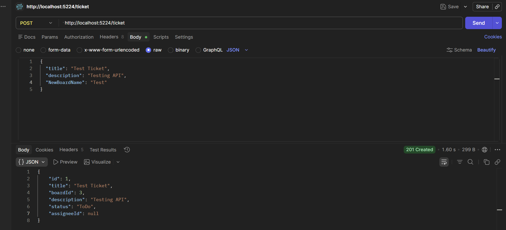

# Ticketing System
In-progress ticketing web app with Jira-like functionality

## [Design doc](./Design.md)

## Demo: Ticket API in Postman 

## Tech
- ASP.NET Core 10, C#, Entity Framework Core + Fluid API, MS SQL Server + Postman for Local Testing
- Frontend: Likely React
- Data: Either Azure SQL Database or Supabase dependent on host
- Hosting: Between Railway, Vercel, and Azure 
- Auth: Likely JWT Auth

## Dev Log
- Wrote models for ticket, user, board, comment, with foreign keys
- Wrote TicketController, Ticket Dto, AppDbContext
- Added AppDbContextFactory so Entity Framework can connect with the MS SQL Server for local testing
- create ticket api, controllers and service set up. 
- fixed cascading deletes 
- wrote board creation logic for creating new ticket (either existing board or new one)
- wrote ticket + board dtos
- added dummy user to appdbcontext for flow to work initially
- assign ticket endpoint works
- wrote get, create board, works in conjunction with create ticket + assign ticket
- wrote change ticket status endpoint
- wrote column model
- next: adjust board and ticket for column
